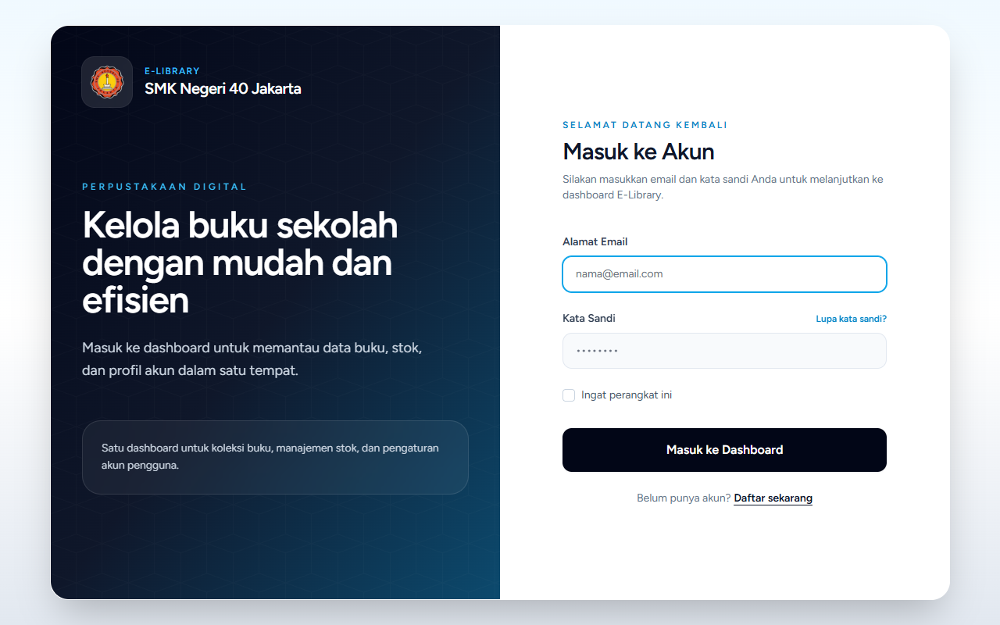
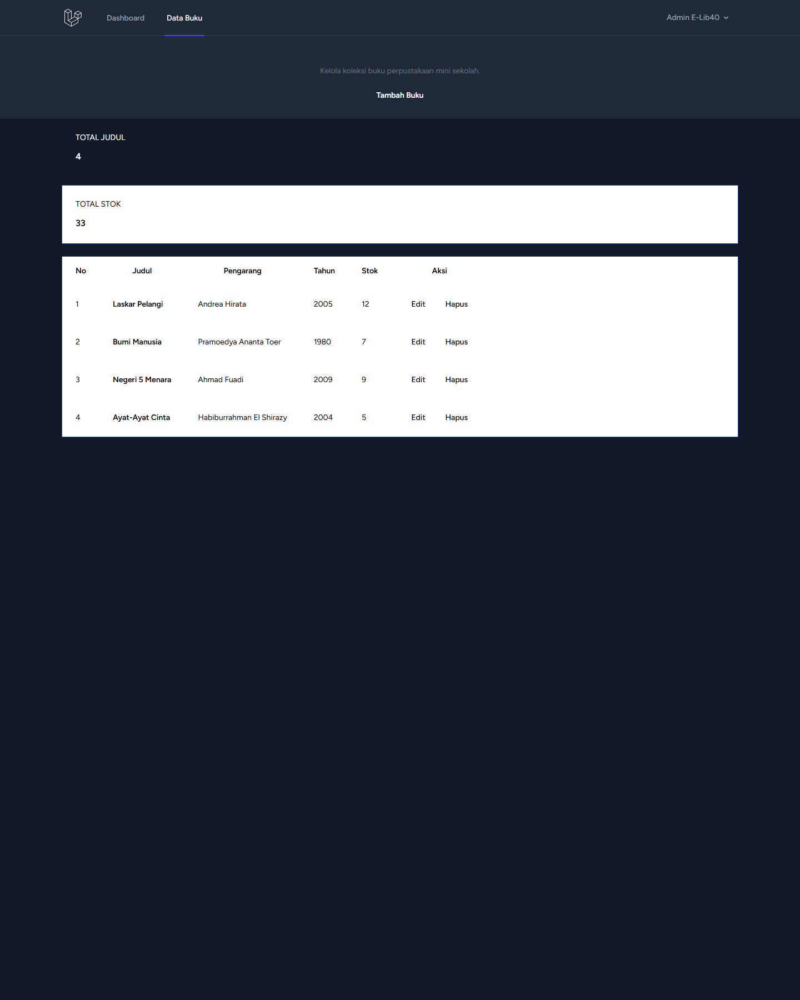
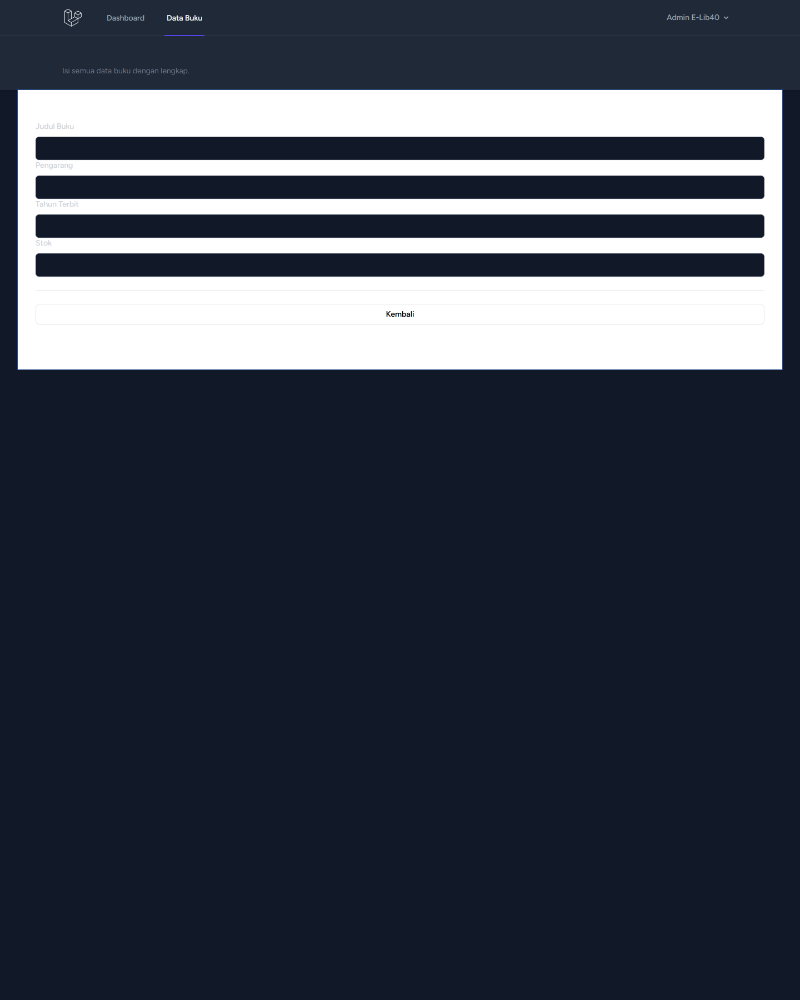

<p align="center">
  <h1 align="center">📚 E-Lib40</h1>
  <p align="center">Sistem Manajemen Perpustakaan Terintegrasi Berbasis Web</p>
</p>

<p align="center">
  <a href="https://laravel.com"></a>
  <a href="https://tailwindcss.com/"></a>
  <a href="https://www.mysql.com/"></a>
  <a href="https://www.php.net/"></a>
</p>

---

## 📖 Deskripsi Proyek

**E-Lib40** adalah sistem informasi manajemen perpustakaan modern yang dikembangkan untuk menyederhanakan proses sirkulasi buku. Sistem ini memfasilitasi administrasi perpustakaan mulai dari pengelolaan katalog buku, pendaftaran anggota, peminjaman buku, hingga manajemen denda secara digital. Dibangun dengan framework **Laravel** dan menggunakan **Tailwind CSS** untuk menghadirkan antarmuka (UI) yang premium, responsif, dan mudah digunakan.

## ✨ Fitur Utama

### 👑 Modul Admin
- **Dashboard Statistik**: Pantauan *real-time* jumlah buku, anggota aktif, dan sirkulasi peminjaman.
- **Manajemen Katalog Buku**: Menambah, mengedit, dan menghapus data buku beserta kategorinya (dengan validasi stok).
- **Manajemen Anggota**: Memverifikasi pendaftaran anggota baru (Approve/Reject) dan pengelolaan *role* (Admin/Siswa).
- **Sirkulasi Peminjaman**: Memproses permintaan peminjaman dari siswa dan mengonfirmasi pengembalian buku.
- **Kelola Denda**: Sistem perhitungan denda otomatis untuk keterlambatan pengembalian dan pelunasan denda.
- **Laporan Bulanan**: Rekapitulasi transaksi peminjaman dan pendapatan denda per bulan.

### 🎓 Modul Siswa (Anggota)
- **Katalog Online**: Eksplorasi koleksi buku perpustakaan yang tersedia.
- **Pengajuan Peminjaman**: Fitur mandiri untuk mengajukan peminjaman buku (*self-service*).
- **Riwayat Transaksi**: Memantau status peminjaman, tanggal jatuh tempo, dan riwayat denda.

---

## 🛠️ Tech Stack

- **Framework**: Laravel 11.x
- **Frontend**: Blade Templating Engine, Tailwind CSS, Alpine.js
- **Database**: MySQL
- **Autentikasi**: Laravel Breeze

---

## 📸 Tampilan Antarmuka

*(Berikut adalah sebagian tangkapan layar dari sistem E-Lib40)*

<details>
  <summary><b>Klik untuk melihat Screenshot</b></summary>

  - **Halaman Login**  
    
  
  **Modul Admin:**
  - **Laporan Bulanan**  
    
    
  - **Kelola Peminjaman**  
    
    
  - **Kelola Denda**  
    

  **Modul Siswa:**
  - **Dashboard Siswa**  
    

  - **Katalog Buku Online**  
    

  - **Riwayat Peminjaman Siswa**  
    
    
  **Lainnya:**
  - **Daftar Buku**  
    
    
  - **Formulir Tambah Buku**  
    

</details>

---

## 🚀 Cara Menjalankan Project (Local Development)

Ikuti langkah-langkah berikut untuk menjalankan sistem di komputer lokal Anda:

### Prasyarat
Pastikan Anda telah menginstal:
- PHP (minimal versi 8.2)
- Composer
- Node.js & NPM
- Database Server (MySQL/MariaDB via Laragon/XAMPP)

### Instalasi

1. **Clone repositori ini** (atau *download* sebagai ZIP):
   ```bash
   git clone https://github.com/btngs/E-Library-40.git
   cd E-Lib40
   ```

2. **Install dependency PHP & Node.js**:
   ```bash
   composer install
   npm install
   ```

3. **Konfigurasi Environment**:
   Salin file konfigurasi bawaan dan sesuaikan nama databasenya.
   ```bash
   cp .env.example .env
   ```
   Buka file `.env` dan pastikan pengaturan database Anda sudah benar (misal menggunakan database `e_lib40`):
   ```env
   DB_CONNECTION=mysql
   DB_HOST=127.0.0.1
   DB_PORT=3306
   DB_DATABASE=e_lib40
   DB_USERNAME=root
   DB_PASSWORD=
   ```

4. **Generate Application Key**:
   ```bash
   php artisan key:generate
   ```

5. **Migrasi Database & Seeding**:
   *Pastikan Anda sudah membuat database kosong bernama `e_lib40` di MySQL Anda sebelum menjalankan perintah ini.*
   ```bash
   php artisan migrate:fresh --seed
   ```

6. **Kompilasi Aset Frontend**:
   ```bash
   npm run build
   ```

7. **Jalankan Server**:
   ```bash
   php artisan serve
   ```
   Aplikasi dapat diakses melalui browser pada `http://127.0.0.1:8000`.

---

## 🔑 Akun Demo (Seeder)

Setelah menjalankan proses seeding (`php artisan db:seed`), Anda dapat masuk ke dalam sistem menggunakan akun demo berikut:

| Peran (Role) | Email | Password | Keterangan |
| :--- | :--- | :--- | :--- |
| **Administrator** | `admin@elib40.test` | `password` | Akses penuh manajemen sistem |
| **Siswa (Anggota)** | *(Menggunakan data dummy Faker)* | `password` | - |

*(Untuk akun siswa, Anda dapat mendaftar akun baru melalui halaman "Register" dan menyetujuinya via akun Admin).*

---

## 🧪 Pengujian (Testing)

Aplikasi ini dilengkapi dengan *Feature Tests* untuk memastikan stabilitas sistem.
Untuk menjalankan pengujian:

```bash
php artisan test
```

---

<p align="center">
  Dibuat dengan ❤️ untuk proyek Pemrograman Web Berbasis Framework.
</p>
